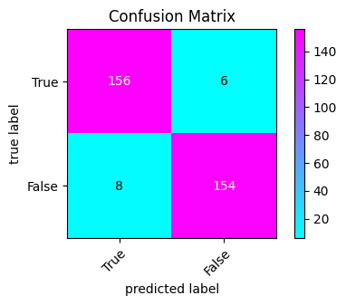

# Hepatitis Prediction RF

This project demonstrates a machine learning pipeline that includes data loading, preprocessing, feature selection with SMOTE integration, model training using Random Forest, and model evaluation.

## Project Structure

```
project/
│
├── .env
├── run.py
├── src/
│   ├── main.py
│   ├── library/
│   │   └── utils.py
│   ├── models/
│   │   └── train.py
│   └── evaluation/
│       └── evaluate.py
└── README.md
```

## Requirements

- Python 3.x
- `dotenv`
- `scikit-learn`
- `imblearn`

Install the required packages using:

```bash
pip install -r requirements.txt
```

## Environment Variables

Create a `.env` file in the root directory and add the following environment variable:

```
DATA_PATH=path/to/your/data.csv
```

## Usage

1. **Load Environment Variables**: The script loads environment variables from the `.env` file.
2. **Load and Preprocess Data**: Data is loaded and preprocessed using functions from `src.library.utils`.
3. **Feature Selection with SMOTE**: Features are selected and SMOTE is applied to handle class imbalance.
4. **Train-Test Split**: The data is split into training and testing sets.
5. **Train Random Forest Model**: A Random Forest model is trained on the training data.
6. **Evaluate the Model**: The model is evaluated on both training and testing data.

Run the main script:

```bash
python main.py
```

## Result

